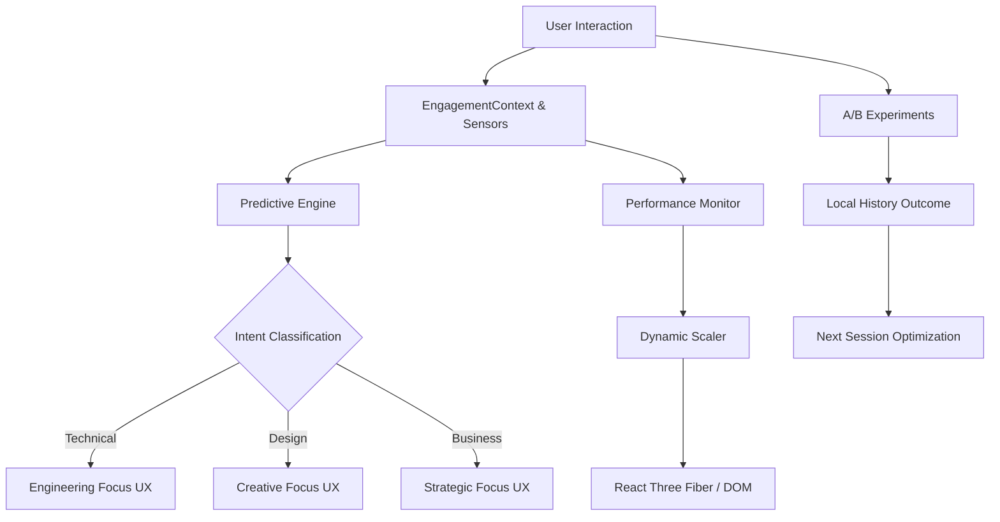

# CODEX NEURAL: AUTONOMOUS ARCHITECTURE

## System Overview
Codex Neural 2.0 operates as a self-regulating ecosystem driven by client-side intelligence.

## Core Components

### 1. The Sensor Array (`EngagementContext`)
- **Inputs**: Mouse Velocity, Scroll Depth, Dwell Time, Click Patterns.
- **Frequency**: 60hz sampling (throttled).
- **Output**: `EngagementState` (Intensity, Focus, Intent).

### 2. The Brain (`PredictiveEngine`)
- **Model**: Heuristic scoring (Weighted categorization).
- **Persistence**: `localStorage` (Privacy-first).
- **Learning**: Updates weights based on "Conversion" events (Form submit, Contact click).

### 3. The Actuators (Adaptive UI)
- **Hero**: Parallax depth & Text Personalization.
- **Services**: Priority sorting & visual highlighting.
- **Portfolio**: Relevance ranking of case studies.
- **Ambience**: Global color shifts (Violet=Creative, Blue=Tech, Amber=Business).

### 4. Self-Optimization (`experiments.ts`)
- **Action**: Biases variant selection based on past "Conversion" success.
- **Loop**: `Variant A -> Success -> Priority A` in future sessions.

## Data Flow
1. **Ingest**: User hovers "AI Models" card (+Tech Score).
2. **Process**: `PredictiveEngine` updates profile. `primaryIntent` shifts to `Technical`.
3. **React**:
    - Global Accent -> Electric Blue.
    - Portfolio -> Reorders "Web3" & "AI" projects to top.
    - Hero (Next Visit) -> "Designing Intelligence".
4. **Optimize**: User clicks "Contact". Current UX configuration saved as "Success".
